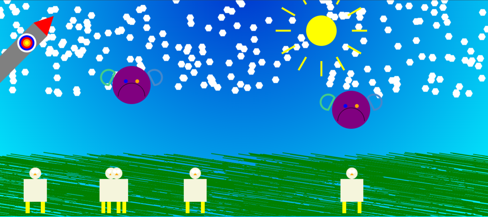
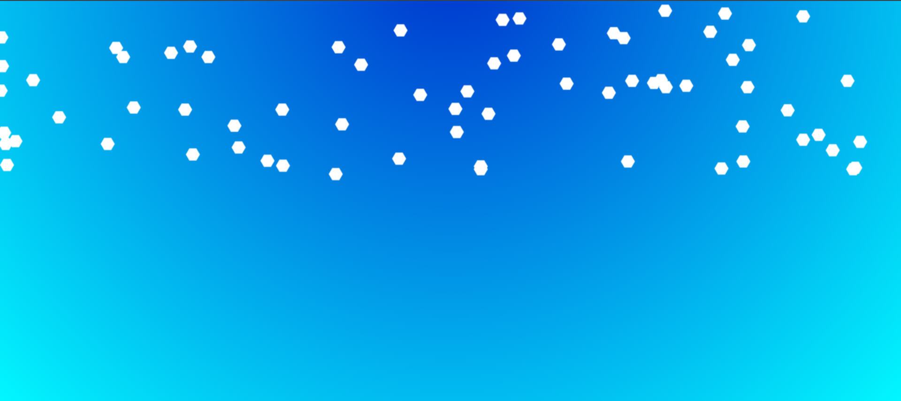
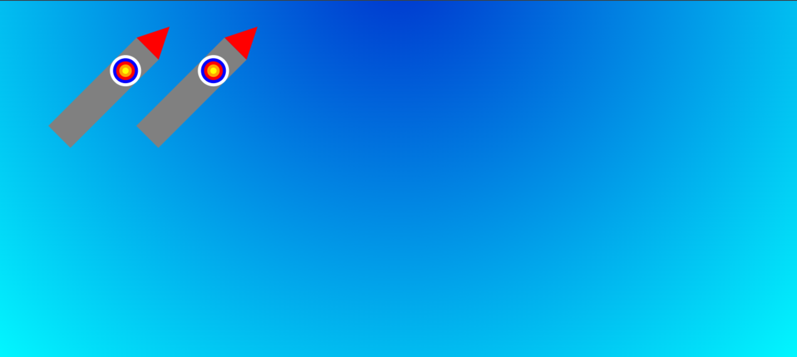
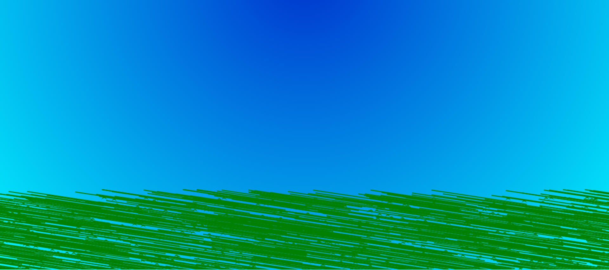
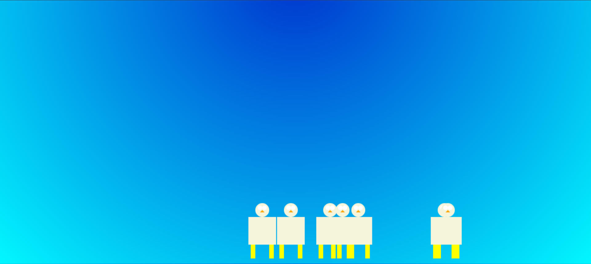
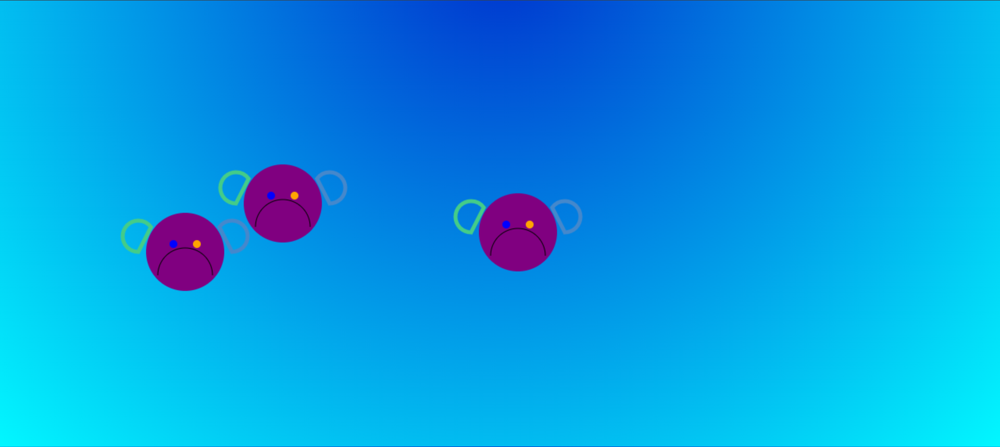

# Virtual landscape
:toc:
== Sommaire


== Prérequis

* Connaissance de base de HTML / CSS (le JS peut être abordé ici pour la première fois)

* Connaissance de base en programmation

* Connaissance de base en POO (programmation orientée objet)

* git de base + IDE (visual studio code, intelliJ, ou autre)


== Introduction

Le but de ce projet est de faire un paysage imaginaire avec JavaScript et lorsque la page est activée et rechargée, chaque éléments change de place de manière aléatoire



- Flocons de neige
- Soleil
- Fusée
- Smiley
- Poule
- Herbe
- Fond bleu foncé dégradé bleu ciel

== Explication

Il y a le constructeur qui permet d'avoir plusieurs paramètres avec les valeurs par defaut pour la classe ( abscisse, ordonnée, largeur, hauteur, couleur, largeur de bordure et pesenteur).

```
(
x = 0,
y = 0,
width = 0,
height = 0,
fillColor = '',
strokeColor = '',
strokeWidth = 2,
pesenteur = false,
ordreConstruction = 100
)
```


Ce code qui permet de déssiner le centre du soleil
```
ctx.fillStyle = 'yellow';
ctx.beginPath();
ctx.arc(centerX, centerY, radius / 2, 0, 2 * Math.PI);
ctx.fill();
```


Ce code permet de dessiner les rayon du soleil autour du centre du soleil

```
const nbRays = 12;
const radius = 80;
const angleStep = (2 * Math.PI) / nbRays;
const centerX = this.x + radius;
const centerY = this.y + radius;
for (let i = 0; i < nbRays; i++) {
const angle = i * angleStep;
const x1 = centerX + radius * Math.cos(angle);
const y1 = centerY + radius * Math.sin(angle);
const x2 = centerX + 1.5 * radius * Math.cos(angle);
const y2 = centerY + 1.5 * radius * Math.sin(angle);
ctx.beginPath();
ctx.moveTo(x1, y1);
ctx.lineTo(x2, y2);
ctx.strokeStyle = 'yellow';
ctx.lineWidth = 5;
ctx.stroke();
```


Ce code est la méthode qui permet de modifier les paramètres de base de classe pour pouvoir modifier, déplacer le dessin

```
static buildForms() {
const mySoleil = new Soleil(0, 0, 0, 0, '', '', 2, false, 2);
let max = ~~(Math.random() *0 ) + 1; // max in [1, 10]
let forms = [];

    for (let i = 0; i < max; i++) {
      forms.push(
        new Soleil(
          ~~(Math.random() * 1000),
          0,
          mySoleil.fillColor,
          mySoleil.strokeColor,
          '',
          false
        )
      );
    }

    return forms;
}
```


Flocon de neige



```
  ctx.fillStyle = this.fillColor;
    ctx.beginPath();
    ctx.moveTo(this.x + this.size * Math.cos(0), this.y + this.size * Math.sin(0));
    for (let i = 1; i < 6; i++) {
      ctx.lineTo(this.x + this.size * Math.cos(i * 2 * Math.PI / 6), this.y + this.size * Math.sin(i * 2 * Math.PI / 6));
    }
    ctx.closePath();
    ctx.fill();
    ctx.restore();
  }

```

Fusée


```
ctx.translate(ox, oy);
    ctx.rotate(Math.PI / 4);
    ctx.translate(-ox, -oy);

    ctx.beginPath();
    ctx.fillStyle = "gray";
    ctx.fillRect(ox + 75, oy + 150, 50, 200);

    ctx.beginPath();
    ctx.moveTo(ox + 75, oy + 150);
    ctx.lineTo(ox + 100, oy + 100);
    ctx.lineTo(ox + 125, oy + 150);
    ctx.closePath();
    ctx.fillStyle = "red";
    ctx.fill();

    ctx.beginPath();
    ctx.fillStyle = "white";
    ctx.arc(ox + 100, oy + 200, 25, 0, 2 * Math.PI);
    ctx.fill();

    ctx.beginPath();
    ctx.fillStyle = "blue";
    ctx.arc(ox + 100, oy + 200, 20, 0, 2 * Math.PI);
    ctx.fill();

    ctx.beginPath();
    ctx.fillStyle = "red";
    ctx.arc(ox + 100, oy + 200, 15, 0, 2 * Math.PI);
    ctx.fill();

    ctx.beginPath();
    ctx.fillStyle = "orange";
    ctx.arc(ox + 100, oy + 200, 10, 0, 2 * Math.PI);
    ctx.fill();

    ctx.beginPath();
    ctx.fillStyle = "yellow";
    ctx.arc(ox + 100, oy + 200, 5, 0, 2 * Math.PI);
    ctx.fill();


```


Herbe


```
// Tige de l'herbe
    ctx.beginPath();
    ctx.moveTo(this.x + 202, this.y + 30);
    ctx.lineTo(this.x + 2, this.y);
    ctx.lineWidth = this.strokeWidth;
    ctx.strokeStyle = this.strokeColor;
    ctx.stroke();

    // Feuille de l'herbe
    ctx.fillStyle = this.fillColor;
    ctx.beginPath();
    ctx.moveTo(this.x + 2, this.y + 20);
    ctx.quadraticCurveTo(this.x + 6, this.y + 10, this.x + 12, this.y + 20);
    ctx.quadraticCurveTo(this.x + 6, this.y + 15, this.x + 2, this.y + 20);
    ctx.fill();
```

Poule


```
ctx.fillStyle = 'beige';
    ctx.fillRect(this.x + 20, this.y + 320, 60, 60); // Corps


    ctx.beginPath();
    ctx.arc(this.x + 50, this.y + 305, 15, 0, 2 * Math.PI); // Tête
    ctx.fill();

    // Yeux
    ctx.fillStyle = 'white';
    ctx.beginPath();
    ctx.arc(this.x + 45, this.y + 300, 5, 0, 2 * Math.PI);
    ctx.fill();
    ctx.beginPath();
    ctx.arc(this.x + 55, this.y + 300, 5, 0, 2 * Math.PI);
    ctx.fill();

    // Bec
    ctx.fillStyle = 'orange';
    ctx.beginPath();
    ctx.moveTo(this.x + 50, this.y + 305);
    ctx.lineTo(this.x + 45, this.y + 310);
    ctx.lineTo(this.x + 55, this.y + 310);
    ctx.closePath();
    ctx.fill();

    // Pattes
    ctx.fillStyle = 'yellow';
    ctx.fillRect(this.x + 25, this.y + 380, 10, 30);
    ctx.fillRect(this.x + 65, this.y + 380, 10, 30);
```

Les smileys


```
ctx.beginPath();
   ctx.fillStyle = "purple";
   ctx.arc(ox+50,oy+90, 50, 0, Math.PI * 2, true);  // Cercle extérieur
   ctx.moveTo(ox+15,oy+55);
   ctx.fill();

   ctx.beginPath();
   ctx.arc(ox+50, oy+120, 35, 0, Math.PI, true);  // Bouche (sens horaire)
   ctx.moveTo(ox+65,oy+105);
   ctx.stroke();

   ctx.beginPath();
   ctx.fillStyle = "blue";
   ctx.arc(ox+35,oy+80, 5, 0, Math.PI * 2, true);  // Oeil gauche
   ctx.moveTo(ox+95,oy+105);
   ctx.fill();

   ctx.beginPath();
   ctx.fillStyle = "orange";
   ctx.arc(ox+65, oy+80, 5, 0, Math.PI * 2, true);  // Oeil droite
   ctx.fill();

   ctx.beginPath();
   ctx.lineWidth = '5';
   ctx.strokeStyle = '#4C8';
   ctx.arc(ox-10,oy+70,20,0.5*Math.PI, 1.8*Math.PI,false);//Arc vert
   ctx.closePath();
   ctx.stroke();

   ctx.beginPath();
   ctx.lineWidth = '5';
   ctx.strokeStyle = '#48C';
   ctx.arc(ox+110,oy+70,20,0.5*Math.PI, 1.2*Math.PI, true);//Arc bleu
   ctx.closePath();
   ctx.stroke();


```


== Difficultés rencontrés

J'avais un gros manque d'imagination donc je ne savais pas du tout quels éléments mettre dans le paysage.
Pas inspiré par le projet. Difficultés au niveau de la réalisation de certains éléments

== Conclusion
Dans ce projet, j'ai appris à faire quelques formes en JavaScript.
J'aurais pu faire un meilleur paysage mais je n'étais pas inspiré et ce projet ne m'emballait pas trop.

